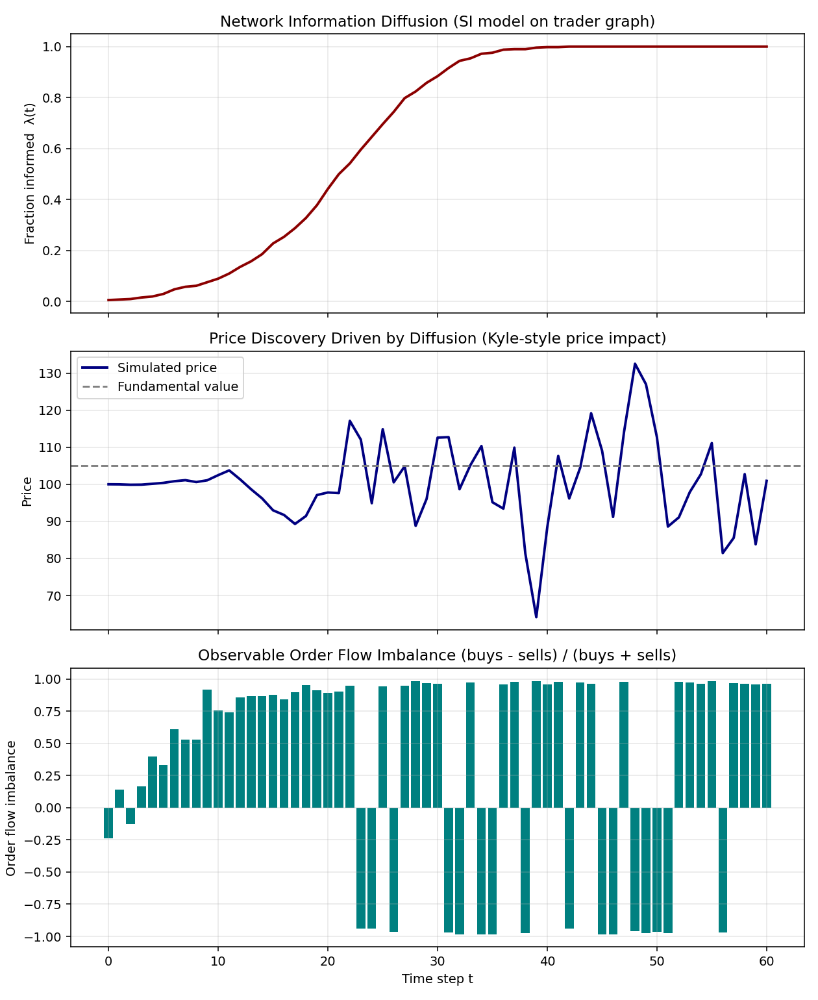

# information-diffusion-model

A market-microstructure model of how private information spreads through a
trading population, and how that diffusion maps into observable order flow
and price impact.

Three composable pieces, since "information diffusion" means different
things depending on the desk:

1. **`NetworkInformationDiffusion`** — an SI (Susceptible-Infected) epidemic
   process on a trader network (Erdős–Rényi, Watts–Strogatz, or
   Barabási–Albert). A signal starts at a small set of seed nodes and spreads
   over discrete time, producing `lambda(t)`: the fraction of the population
   informed at each step. This is the standard reduced-form for gradual
   information diffusion effects (analyst-coverage spread, lead-lag /
   cross-asset momentum spillover, etc.).

2. **`KyleKMicrostructure`** — takes `lambda(t)` and generates informed vs.
   noise order flow each period, then updates price via a Kyle (1985)-style
   linear price-impact rule whose sensitivity scales with the current
   informed fraction. Produces a full synthetic trade tape (buy/sell counts
   per period).

3. **`PINEstimator`** — Easley & O'Hara (1992) maximum-likelihood estimator
   that solves the *inverse* problem: recovers the probability of informed
   trading purely from observed buy/sell counts, with no knowledge of the
   true diffusion process. Can be pointed directly at real trade-classified
   data (e.g. TAQ) instead of simulated output.

`InformationDiffusionMarketModel` wires all three into a single
`simulate()` → `summary()` pipeline.

## Install

```bash
git clone <this repo>
cd information-diffusion-model
pip install -r requirements.txt
```

## Quick start

```python
from information_diffusion_model import (
    NetworkInformationDiffusion,
    KyleKMicrostructure,
    InformationDiffusionMarketModel,
)

diffusion = NetworkInformationDiffusion(n_traders=500, topology="watts_strogatz", beta=0.06)
micro = KyleKMicrostructure(fundamental_value=105.0, sigma_u=40.0, n_traders=500)

model = InformationDiffusionMarketModel(diffusion, micro)
df = model.simulate(n_periods=60, p0=100.0)
print(model.summary())
```

Run the full demo (simulate, re-estimate PIN in rolling windows, plot):

```bash
python examples/run_demo.py
```

This produces `examples/output/diffusion_model_output.png`:



## Validation

The demo simulates a market with a known diffusion curve, then re-estimates
PIN from the resulting trade tape *without* using the true diffusion curve.
Estimated PIN tracks the true informed fraction as it rises — the check that
the microstructure layer is internally consistent.

## Known limitation

The price panel can oscillate once `lambda(t) -> 1`: this is a real
discrete-time instability in linear Kyle-impact models when informed flow is
large relative to `sigma_u`. Tune `order_size_unit` / `sigma_u` down, or add
a partial-adjustment term, if you need a smoother price path.

## Tests

```bash
pip install pytest
pytest tests/
```

## License

MIT — see `LICENSE`.
